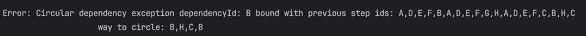
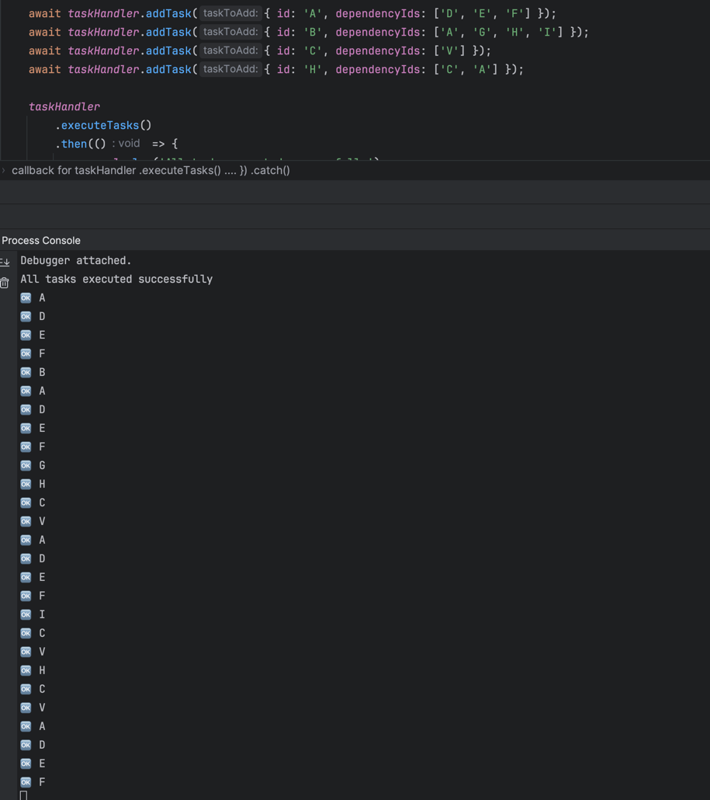

## Description
Template raw mssql client on node.js

## Installation

nvm should be available
```sh
$ nvm -v
```
---
Use or download and setup node
```bash
$ nvm use
```
Install all dependency
```bash
$ npm i
```
Create .env files to be able up DB and App

Duplicate `.envs` & change & copy to .env and ./db/init.env:
```bash
ENV_CONTENT="#Agrea With User Licence Agreement
ACCEPT_EULA=Y

# Specify host of the database server
MSSQL_HOST=mssql

# Specify password for Supper Admin user of whole DB with login: 'sa'
MSSQL_SA_PASSWORD=password1!

# no idea what it actually do
MSSQL_PID=Express

# Specify port on which the database server available on MSSQL_HOST 
MSSQL_PORT=1433

# Specify login for user that owned of MSSQL_DATABASE DB with password: MSSQL_PASSWORD
MSSQL_USER=user

# Specify password for user that owned of MSSQL_DATABASE DB with login: MSSQL_USER
MSSQL_PASSWORD=password2!

# Specify Database name that need to create for user  for user MSSQL_USER
MSSQL_DATABASE=main
"

echo "$ENV_CONTENT" > .env 
echo "$ENV_CONTENT" > db/.env
```

## Running the app
Build and run DB in docker
```bash
$ npm run db:clean && npm run db:start
```

Development
```bash
$ npm run start
```

Watch mode
```bash
$ npm run start:dev
```

Watch mode nodemon
```bash
$ npm run start:nodemon
```

## Solution 

I really do not know how this task can be solved in one and a half hours, considering that I spent two hours just investigating and handling about 80% of the scenarios. Nevertheless, this is an amazing task that, at first glance, seems simple, but when you dive a little deeper, it reveals corner cases that should have been restricted by technical requirements at the architectural stage.

The trickiest part is the lack of restrictions for this task, which I was not able to gather during the interview.

Searching for circular dependencies can be implemented at different levels, such as:
1.	During task insertion into the database – by ensuring that the TaskId of the new task does not already exist as a dependency at the first level.
2.	Before execution – we can retrieve the entire task flow from the database, including all child tasks. Using a modified DFS, we can detect any already existing vertices in the stack, which keeps track of all previous parent-child relationships.
•	If no circular dependency is detected, we already have the entire execution stack in memory with all the tasks that need to be processed.
3.	During runtime execution – similar to the second approach, but instead of preloading all tasks at once, we fetch them incrementally from the database in batches of 10 to 20 (or another appropriate number). This helps reduce memory usage while continuing task execution until a circular dependency is detected. For me, this seems to be the best approach.

At the moment, I do not know the real use case for this data and lack analytical insights that would allow me to determine the best solution based on:
•	The average depth of dependencies.
•	The degree of coupling among tasks.

I decided to choose the second approach since I prefer to start executing tasks while ensuring that they will complete successfully.

And the execution flow is as follows:

- Get the older Task (created_at column) that not completed
- Get all dependencies of first level 
- going one by one on dependency going through each element in a deep and add parent vertex ino the Stack to check 
do we meet any other Task with id that currently stored in stack -if yes we found circular dependency 
if no wan we return back we will delete nested Task with that we already solved with all dependency from Stack
- And move forward until our recursive circle not return false that means that we do not meet any circular dependency. 

And only after that start doing tasks that already in memory and in correct order from Stack that we used for DFS 
(not to be confused with the stack which temporarily stores task ids to find cyclic dependencies )

Spend some time to determinate which way will work better.


Examole of error that apiary during preparation to execute tasks in case of circular dependency:


Success result of executing 


